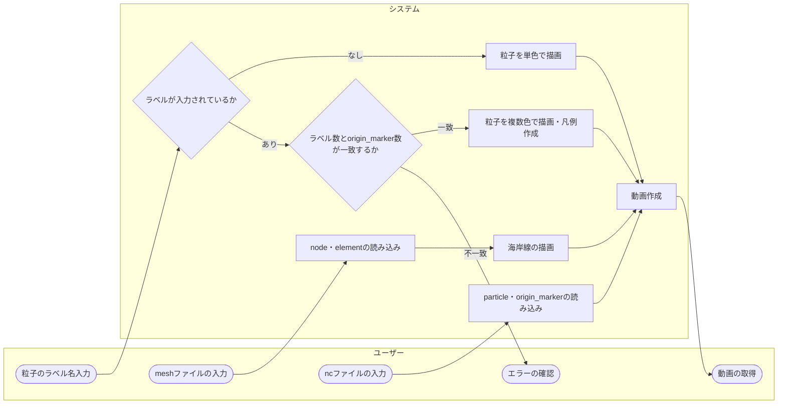

```mermaid
flowchart LR
    subgraph User["ユーザー"]
        direction TB
        U1([meshファイルの入力])
        U2([ncファイルの入力])
        U3([粒子のラベル名入力])
        U6([動画の取得])
        U7([エラーの確認])
    end

    subgraph System["システム"]
        direction TB

        S1[node・elementの読み込み]
        S2[海岸線の描画]
        S3[particle・origin_markerの読み込み]

        S4{ラベルが入力されているか}

        S5{ラベル数とorigin_marker数が一致するか}

        S6[粒子を単色で描画]
        S7[粒子を複数色で描画・凡例作成]

        S8[動画作成]

        S1 --> S2
        S4 -->|なし| S6
        S4 -->|あり| S5
        S5 -->|一致| S7
        S5 -->|不一致| U7
        S6 --> S8
        S7 --> S8
        S3 --> S8
    end

    U1 --> S1
    U2 --> S3
    U3 --> S4
    S2 --> S8
    S8 --> U6
```